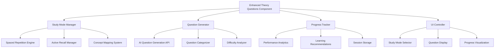

# Design Document

## Overview

The Enhanced Theory Questions feature will transform the current basic theory questions functionality into a comprehensive learning system that incorporates evidence-based study methods. The design focuses on three core study techniques: spaced repetition, active recall, and concept mapping, all integrated into a user-friendly interface that adapts to individual learning patterns.

The system will generate theory questions from extracted text and present them through multiple study modes, each designed to optimize different aspects of learning and retention. The architecture will support progress tracking, adaptive difficulty, and personalized learning recommendations.

## Architecture

### High-Level Architecture



### Component Structure

The enhanced theory questions system will be built as a modular architecture with the following main components:

1. **EnhancedTheoryQuestions** - Main container component
2. **StudyModeSelector** - Interface for choosing study methods
3. **SpacedRepetitionMode** - Implements spaced repetition algorithm
4. **ActiveRecallMode** - Implements active recall techniques
5. **ConceptMappingMode** - Shows relationships between concepts
6. **ProgressTracker** - Tracks and analyzes learning progress
7. **QuestionRenderer** - Displays questions with enhanced formatting
8. **PerformanceAnalytics** - Provides learning insights and recommendations

## Components and Interfaces

### EnhancedTheoryQuestions Component

**Props Interface:**

```typescript
interface EnhancedTheoryQuestionsProps {
  title: string;
  extractedText: string;
  questions: TheoryQuestion[];
  clearPDF: () => void;
  onSaveProgress?: (progress: StudyProgress) => void;
}

interface TheoryQuestion {
  id: string;
  question: string;
  options: string[];
  answer: "A" | "B" | "C" | "D";
  explanation: string;
  difficulty: "basic" | "intermediate" | "advanced";
  concepts: string[];
  relatedQuestions: string[];
}
```

**State Management:**

- Current study mode
- Question progress and performance
- Spaced repetition scheduling
- User preferences and settings
- Session analytics

### StudyModeSelector Component

**Interface:**

```typescript
interface StudyMode {
  id: string;
  name: string;
  description: string;
  benefits: string[];
  icon: React.ComponentType;
  color: string;
}

interface StudyModeProps {
  modes: StudyMode[];
  onModeSelect: (mode: StudyMode) => void;
  currentMode?: StudyMode;
}
```

### SpacedRepetitionEngine

**Algorithm Implementation:**

- Uses SM-2 algorithm for optimal spacing intervals
- Tracks ease factor for each question
- Schedules reviews based on performance
- Adapts intervals based on user success rate

**Interface:**

```typescript
interface SpacedRepetitionData {
  questionId: string;
  easeFactor: number;
  interval: number;
  repetitions: number;
  nextReview: Date;
  lastReviewed: Date;
}

interface SpacedRepetitionEngine {
  scheduleQuestion(
    questionId: string,
    performance: number
  ): SpacedRepetitionData;
  getQuestionsForReview(date: Date): string[];
  updatePerformance(
    questionId: string,
    correct: boolean,
    responseTime: number
  ): void;
}
```

### ActiveRecallManager

**Implementation Strategy:**

- Presents questions without immediate answer options
- Encourages mental retrieval before revealing choices
- Tracks confidence levels and self-assessment
- Provides retrieval practice analytics

**Interface:**

```typescript
interface ActiveRecallSession {
  questionId: string;
  mentalRetrievalTime: number;
  confidenceLevel: 1 | 2 | 3 | 4 | 5;
  selfAssessment: "correct" | "partial" | "incorrect";
  actualPerformance: boolean;
}
```

### ConceptMappingSystem

**Features:**

- Identifies conceptual relationships in questions
- Groups related questions by theme
- Shows concept hierarchies and dependencies
- Provides visual concept maps

**Interface:**

```typescript
interface ConceptMap {
  concepts: ConceptNode[];
  relationships: ConceptRelationship[];
}

interface ConceptNode {
  id: string;
  name: string;
  description: string;
  questions: string[];
  difficulty: number;
}

interface ConceptRelationship {
  from: string;
  to: string;
  type: "prerequisite" | "related" | "example" | "application";
  strength: number;
}
```

## Data Models

### Question Storage Model

```typescript
interface EnhancedTheoryQuestion extends TheoryQuestion {
  metadata: {
    createdAt: Date;
    source: string;
    tags: string[];
    averageResponseTime: number;
    successRate: number;
  };
  spacedRepetition: SpacedRepetitionData;
  conceptMapping: {
    primaryConcepts: string[];
    secondaryConcepts: string[];
    prerequisites: string[];
  };
}
```

### Progress Tracking Model

```typescript
interface StudyProgress {
  userId?: string;
  sessionId: string;
  startTime: Date;
  endTime?: Date;
  studyMode: string;
  questionsAttempted: number;
  questionsCorrect: number;
  averageResponseTime: number;
  difficultyProgression: DifficultyLevel[];
  conceptsMastered: string[];
  weakAreas: string[];
  recommendations: LearningRecommendation[];
}

interface LearningRecommendation {
  type: "review" | "practice" | "concept_study";
  priority: "high" | "medium" | "low";
  description: string;
  suggestedActions: string[];
}
```

### Session Analytics Model

```typescript
interface SessionAnalytics {
  performanceMetrics: {
    accuracy: number;
    speed: number;
    consistency: number;
    improvement: number;
  };
  learningPatterns: {
    preferredDifficulty: DifficultyLevel;
    optimalSessionLength: number;
    bestPerformanceTime: string;
    strugglingConcepts: string[];
  };
  recommendations: {
    nextStudyMode: string;
    focusAreas: string[];
    scheduledReviews: Date[];
  };
}
```

## Error Handling

### Question Generation Errors

- Fallback to cached questions if API fails
- Graceful degradation to basic question format
- User notification with retry options
- Automatic error reporting for improvement

### Study Mode Errors

- Fallback to standard question presentation
- Progress preservation during mode switches
- Recovery from interrupted sessions
- Data validation and sanitization

### Performance Tracking Errors

- Local storage backup for progress data
- Graceful handling of missing analytics
- Default recommendations when data is insufficient
- Error boundary components for UI stability

## Testing Strategy

### Unit Testing

- **Question Generation Logic**: Test AI integration and question formatting
- **Spaced Repetition Algorithm**: Verify scheduling calculations and interval adjustments
- **Active Recall Logic**: Test confidence tracking and self-assessment features
- **Concept Mapping**: Verify relationship detection and grouping algorithms
- **Progress Tracking**: Test analytics calculations and recommendation generation

### Integration Testing

- **Study Mode Transitions**: Test seamless switching between different modes
- **Data Persistence**: Verify progress saving and loading across sessions
- **API Integration**: Test question generation and error handling
- **Component Communication**: Verify data flow between parent and child components

### User Experience Testing

- **Study Mode Effectiveness**: Validate that each mode provides educational value
- **Interface Usability**: Test navigation, accessibility, and user flow
- **Performance Impact**: Ensure smooth operation with large question sets
- **Mobile Responsiveness**: Test on various screen sizes and devices

### Performance Testing

- **Question Loading**: Test with large sets of generated questions
- **Analytics Processing**: Verify performance with extensive progress data
- **Memory Usage**: Monitor component memory consumption during long sessions
- **Rendering Performance**: Test smooth animations and transitions

## Implementation Phases

### Phase 1: Core Infrastructure

- Enhanced question data model
- Basic study mode selector
- Progress tracking foundation
- Updated UI components

### Phase 2: Spaced Repetition

- SM-2 algorithm implementation
- Question scheduling system
- Review queue management
- Performance tracking integration

### Phase 3: Active Recall

- Mental retrieval interface
- Confidence level tracking
- Self-assessment features
- Retrieval practice analytics

### Phase 4: Concept Mapping

- Concept relationship detection
- Visual concept mapping
- Question grouping by concepts
- Conceptual progress tracking

### Phase 5: Analytics and Recommendations

- Advanced performance analytics
- Learning pattern recognition
- Personalized recommendations
- Progress visualization

### Phase 6: Polish and Optimization

- UI/UX refinements
- Performance optimizations
- Accessibility improvements
- Mobile experience enhancement
